= How to realize various actions in a one-button game
DEV Community
:keywords: gamedev, software, coding, development, engineering, inclusive, community
:lang: en
:toc:
:sectnums:

[[main-content]]
[[main-title]]
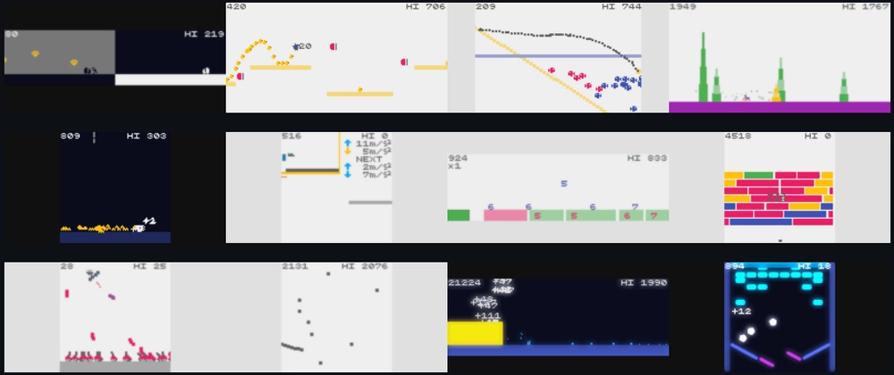

[[action-space]]

https://dev.to/abagames[]

https://dev.to/abagames[ABA Games]

Posted on 16. Mai 2022

https://dev.to/t/gamedev[#gamedev]

[[article-body]]
== Introduction

Recently, I've been
https://github.com/abagames/111-one-button-games-in-2021/blob/main/README.md[making a lot of one-button mini-games]. The one-button games discussed in this article are not games that use one button in addition to the joystick for movement but games that use only one button purely for control.

The advantage of one-button games is that they are easy to understand
and operate, even on touch devices. There is almost no need to explain the operations in the game because the player can see all the possible actions that can occur in the game by pressing a button. Also, when playing with a touch device, you can control the game by tapping or holding anywhere on the screen, so you don't have to deal with the problem that often occurs with virtual pads where there is no feeling of pressing a button.

One obvious drawback of one-button games is that it is difficult to give variation to the actions in the game. Even the left-right movement, which can be easily achieved with a joystick, requires a unique control that reverses the direction of movement when the button is pressed.

Therefore, the problem in creating a one-button game is how to give variation to the game's interaction with just one button. I want to discuss how to solve the above problem using some examples of one-button games that I have made.

== Introduce unique movements

In one-button games, the player commonly performs the following actions when a button is pressed.

* Reverse the direction of movement / Turn 90 degrees
* Jump / Flap wings
* Shoot the bullet

The following game is an example of a game where the direction of movement is reversed by a button (Click the link to play it in your browser).

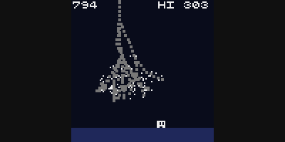

https://abagames.github.io/crisp-game-lib-games/?thunder[THUNDER]

If a game requires the player only to move in two directions, it is
possible to make it a one-button game. However, it is not a game with
the unique characteristics of a one-button game.

If the actions with the button operation are rarely seen in regular
games, players will be enormously impressed that the game is unique to a one-button operation. Some examples of such particular behavior are listed below.

== Teleportation

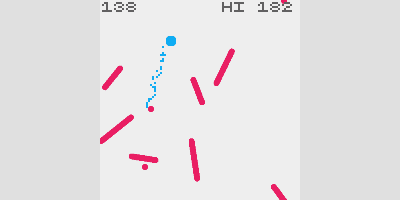

https://abagames.github.io/crisp-game-lib-games/?cywall[CYWALL]

You can see points where the player can move, and the player instantly moves to the nearest point when pressing. The advantage of this behavior is that the player can move quickly by pressing a button repeatedly.

== Splitting

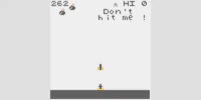

https://abagames.github.io/crisp-game-lib-games/?divarr[DIVARR]

Each time you press a button, the missile splits. You can enjoy the increased attack power just by pressing the button rapidly. To make the game more interesting, you could add an object that becomes game over when the missile hits it.

== Choice

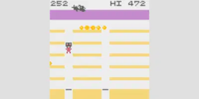

https://abagames.github.io/crisp-game-lib-games/?jumpon[JUMP ON]

The player can choose to jump to the floor at a certain point. It should be clear to the player that there is a place on the game screen where they can choose which way to go.

== Reversing attribute

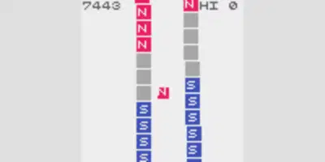

https://abagames.github.io/crisp-game-lib-games/?nsclimb[NS CLIMB]

Each time you press a button, the attributes, such as N and S poles, are switched. The key to the game is to think about what to use for the attributes and how the attributes relate to other objects in the game.

== Other special actions

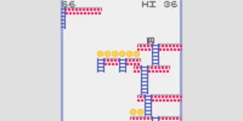

https://abagames.github.io/crisp-game-lib-games/?ladderdrop[LADDER DROP]

Drop the floor and ladders moving left and right with good timing. It is also a one-button game version of the falling block game.

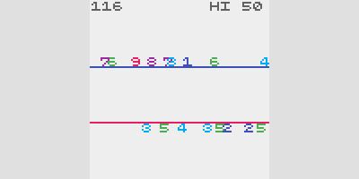

https://abagames.github.io/crisp-game-lib-games/?numberline[NUMBER LINE]

Sum the numbers that are flowing. This operation is too specific to be used as a reference for creating other games, but it is an example of the many possible actions assigned to a button.

== Use of button press-and-hold operation

In a one-button game, some action usually occurs when you press a button, but you can also continuously make something happen while you hold it down.

== Adjust angle and distance

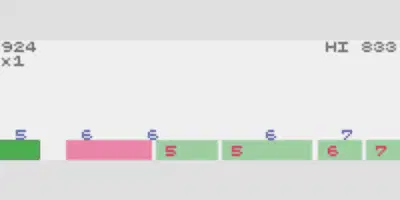

https://abagames.github.io/crisp-game-lib-games/?numberball[NUMBER BALL]

As is common in golf games, the angle of the shot increases as you hold down the button, so you have to release the button at just the right moment to launch the ball. This game is differentiated from golf games by the mysterious rule that the floor disappears if the number you hit matches the number on the floor.

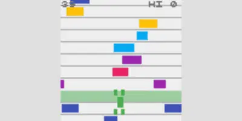

https://abagames.github.io/crisp-game-lib-games/?froooog[FROOOOG]

The distance the frog jumps is determined by the time the button is held down.

== Telescoping

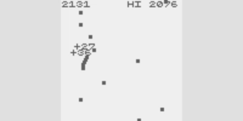

https://abagames.github.io/crisp-game-lib-games/?pinclimb[PIN CLIMB]

While you hold down the button, the stick stretches, and when you release it, it shrinks. We can combine the stretching and shrinking motion with the terrain on the game screen. In this game, the stretching stick gets caught in the pin and moves forward by extending further from there.

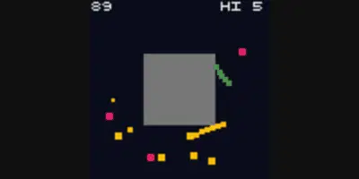

https://abagames.github.io/crisp-game-lib-games/?squarebar[SQUARE BAR]

When combined with geometric figures, we can realize complex movements using only stretching and shrinking motions.

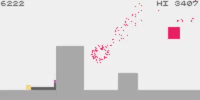

https://abagames.github.io/crisp-game-lib-games/?tapej[TAPE J]

Stretching your body increases your points, increasing the risk of hitting an obstacle. This mechanism will balance the risk-reward in the game.

== Defend against / Prevent being hit

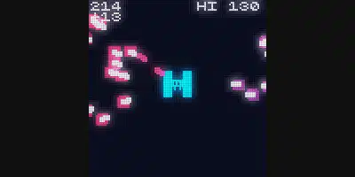

https://abagames.github.io/crisp-game-lib-games/?embattled[EMBATTLED]

As long as you hold down the button, shells will not hit you. When the tanks get close enough, you can release your defenses and avoid shells by moving up and down, and the tanks will fight each other on their own.

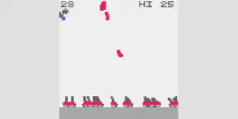

https://abagames.github.io/crisp-game-lib-games/?reflector[REFLECTOR]

The player attaches a defensive wall for reflecting enemy bullets. But as long as you hold down the button, the defensive wall becomes smaller instead of allowing a powerful counterattack.

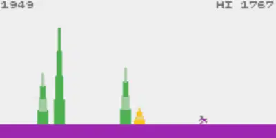

https://abagames.github.io/crisp-game-lib-games/?bamboo[BAMBOO]

When you hold the button down, you will not hit the bamboo and can slip through the bamboo. Then you will be able to get in between the bamboos and bounce around, allowing you to cut the bamboo quickly.

== Other special actions

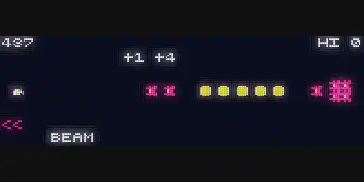

https://abagames.github.io/crisp-game-lib-games/?chargebeam[CHARGE BEAM]

Charge energy. The game is not viable unless you make it meaningful to adjust the amount of charge.

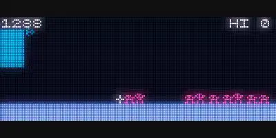

https://abagames.github.io/crisp-game-lib-games/?laserfortress[LASER FORTRESS]

Mom down. A super-powerful subclass of shooting. By mixing allies with enemies, the super-powerful attack is also a drawback.

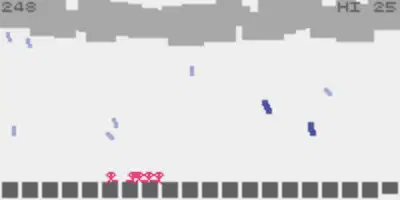

https://abagames.github.io/crisp-game-lib-games/?shiny[SHINY]

It rains, and it clears. While it is raining, people will move faster, and you can make them move to the far right earlier. This action is so unusual that it is difficult to adapt to other games.

== Combination of multiple actions

Combining the above actions is also a standard way to create a one-button game.

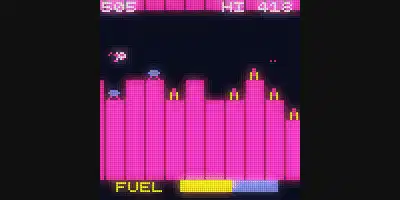

https://abagames.github.io/crisp-game-lib-games/?scrambird[SCRAMBIRD]

Flap wings {plus} shoot,

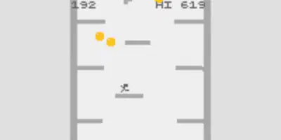

https://abagames.github.io/crisp-game-lib-games/?tilted[TILTED]

multiple jumps {plus} reverse the direction and

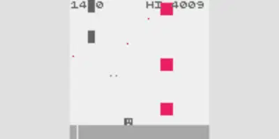

https://abagames.github.io/crisp-game-lib-games/?upshot[UP SHOT]

shoot {plus} stop.

Another combination approach is to have a particular action have multiple effects in the game.

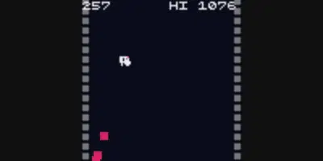

https://abagames.github.io/crisp-game-lib-games/?bombup[BOMB UP]

In this game, you can use the button to drop and explode bombs, but in addition to that, the blast will affect the player by blowing it up. By adjusting the position of the explosion, you can control the player's movement. It is possible to perform quite complex actions with a single button. But if you overdo it, it becomes too difficult to control the player's movements. Hence, it is essential to adjust the level of complexity.

== Combination with rotational motion

Similar to angle adjustment, there is also a way to make the game more timing-oriented, where the player or barrel is constantly spinning and jumping out or shooting at the right moment.

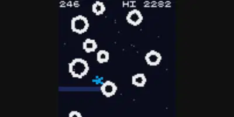

https://abagames.github.io/crisp-game-lib-games/?orbitman[ORBIT MAN]

The player's jumping direction is rotating so that the player jumps out at the right time in the direction of the next star.

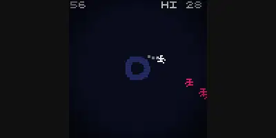

https://abagames.github.io/crisp-game-lib-games/?arcfire[ARCFIRE]

The barrel of the gun rotates, so shoot at the right moment when the barrel is facing the enemy. You can adjust the range and the attack range in this game by holding down the buttons. When the button is released, an arc-shaped bullet is fired in that direction, and the player moves forward slightly. In this way, you can perform various actions with a single button.

== Use of terrain

If it's challenging to add variation to the movements using only button inputs, you can change the actions depending on the terrain the player is standing on.

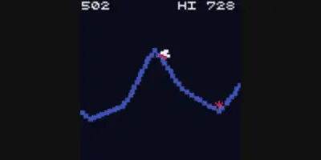

https://abagames.github.io/crisp-game-lib-games/?turbulent[TURBULENT]

By making the terrain a rough sea surface, a simple button jump can change the direction of the jump depending on the timing.

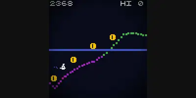

https://abagames.github.io/crisp-game-lib-games/?subjump[SUB JUMP]

The lower half of the screen is underwater, and the upper half is air. Thus, the button can play multiple roles, such as ascending when in the water and jumping when in the air.

== Use of items

In addition to terrain, we can use items to provide variation in behavior. By making it a rule that taking an item changes the player's mode, we can add the choice to take or not take an item as a method of interaction to the game.

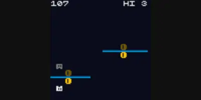

https://abagames.github.io/crisp-game-lib-games/?mirrorfloor[MIRROR FLOOR]

Each time you take a coin, the direction of gravity switches. If you don't look carefully at the position of the next floor and choose whether or not to take the coin, you will not be able to jump to the next floor.

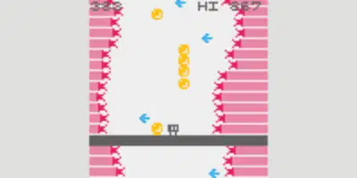

https://abagames.github.io/crisp-game-lib-games/?liftup[LIFT UP]

When you take an item, your direction of movement reverses. You need to get the reversing items before hitting the spikes on the left and right.

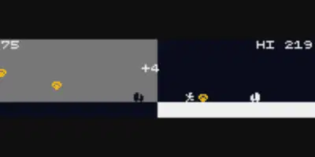

https://abagames.github.io/crisp-game-lib-games/?rebirth[REBIRTH]

When you are run over by a truck, you move to the opposite world. Whether the truck is an item is debatable, but you can choose to be run over by the truck or not by looking at the location of the following diamond you should take.

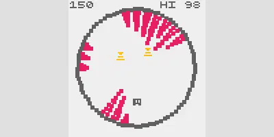

https://abagames.github.io/crisp-game-lib-games/?rwheel[R WHEEL]

When you pick up an item, it fires a yellow laser downward to destroy the obstacle spikes. The item appears when the player jumps, but at the same time, a purple laser that grows spikes is shot below the player so that the player cannot jump too often.

== Conclusion

As you can see, it is possible to create many variations of movements even with a single button. Even with just the games listed in this article, we made it possible to make various game types.

One-button games are easy to operate, but this sometimes leads to games where you can score infinite points simply by repeatedly hitting or holding the buttons. So, after creating a game, be sure to play it by repeatedly pressing and holding the buttons to see if such problems occur.

Also, as a basic premise, there is no relationship between whether a game is a one-button game and whether it is exciting or boring. Therefore, it is vital that the game has a sense of exhilaration and tension and a good balance of risk and reward and should be attractive as a game.

The DEV Team

