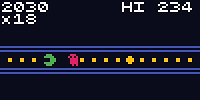
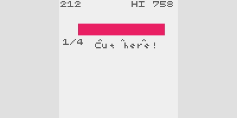
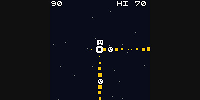
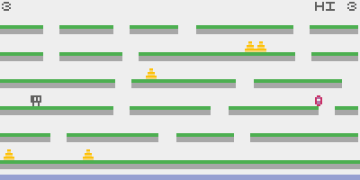
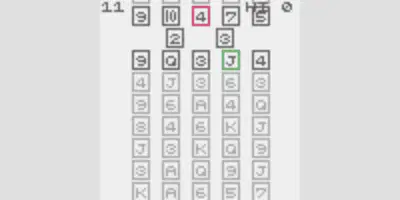
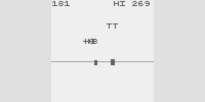

= crisp-game-lib, a game library for creating mini-games with minimal
effort - DEV Community
:keywords: gamedev, javascript, typescript, software, coding,
development, engineering, inclusive, community
:lang: en

[[main-content]]
[[main-title]]
[[action-space]]

https://dev.to/abagames[image:./index_files/https___dev-to-uploads.s3.us-east-2.amazonaws.com_uploads_user_profile_image_859761_871a936d-2aa9-4fdd-91cc-74410e64683e.png[ABA
Games,width=40,height=40]]

https://dev.to/abagames[ABA Games]

Posted on 17. Mai 2022 • Edited on 20. Okt. 2024

[.crayons-reaction__icon .crayons-reaction__icon--inactive .p-1]#image:./index_files/sparkle-heart-5f9bee3767e18deb1bb725290cb151c25234768a0e9a2bd39370c382d02920cf.svg[./index++_++files/sparkle-heart-5f9bee3767e18deb1bb725290cb151c25234768a0e9a2bd39370c382d02920cf,width=24,height=24]#
[#reaction_engagement_like_count .crayons-reaction__count]#1#

[.crayons-reaction__icon .crayons-reaction__icon--inactive .p-1]#image:./index_files/multi-unicorn-b44d6f8c23cdd00964192bedc38af3e82463978aa611b4365bd33a0f1f4f3e97.svg[./index++_++files/multi-unicorn-b44d6f8c23cdd00964192bedc38af3e82463978aa611b4365bd33a0f1f4f3e97,width=24,height=24]#
[#reaction_engagement_unicorn_count .crayons-reaction__count]# #

[.crayons-reaction__icon .crayons-reaction__icon--inactive .p-1]#image:./index_files/exploding-head-daceb38d627e6ae9b730f36a1e390fca556a4289d5a41abb2c35068ad3e2c4b5.svg[./index++_++files/exploding-head-daceb38d627e6ae9b730f36a1e390fca556a4289d5a41abb2c35068ad3e2c4b5,width=24,height=24]#
[#reaction_engagement_exploding_head_count .crayons-reaction__count]# #

[.crayons-reaction__icon .crayons-reaction__icon--inactive .p-1]#image:./index_files/raised-hands-74b2099fd66a39f2d7eed9305ee0f4553df0eb7b4f11b01b6b1b499973048fe5.svg[./index++_++files/raised-hands-74b2099fd66a39f2d7eed9305ee0f4553df0eb7b4f11b01b6b1b499973048fe5,width=24,height=24]#
[#reaction_engagement_raised_hands_count .crayons-reaction__count]# #

[.crayons-reaction__icon .crayons-reaction__icon--inactive .p-1]#image:./index_files/fire-f60e7a582391810302117f987b22a8ef04a2fe0df7e3258a5f49332df1cec71e.svg[./index++_++files/fire-f60e7a582391810302117f987b22a8ef04a2fe0df7e3258a5f49332df1cec71e,width=24,height=24]#
[#reaction_engagement_fire_count .crayons-reaction__count]# #

== crisp-game-lib, a game library for creating mini-games with minimal effort

https://dev.to/t/gamedev[[.crayons-tag__prefix]##++#++##gamedev]
https://dev.to/t/typescript[[.crayons-tag__prefix]##++#++##typescript]
https://dev.to/t/javascript[[.crayons-tag__prefix]##++#++##javascript]

[[article-body]]
`crisp-game-lib` is a JavaScript library for making browser games
quickly and easily. I made 50 minigames in 2014, and I made Haxe library
https://github.com/abagames/mgl[mgl] and CoffeeScript library
https://github.com/abagames/mgl.coffee[mgl.coffee] to make those games.
After that, I continued to make mini-games and libraries. Using this
experience, I created `crisp-game-lib` as a library with the minimum
functionality needed to create classic, arcade-like mini-games.

===  https://github.com/abagames[abagames] / https://github.com/abagames/crisp-game-lib[crisp-game-lib]

==== Minimal JavaScript library for creating classic arcade-like mini-games running in the browser

[[readme]]
https://abagames.github.io/crisp-game-lib-11-games/?pakupaku[]https://abagames.github.io/crisp-game-lib-11-games/?timbertest[]https://abagames.github.io/crisp-game-lib-11-games/?meteoplanet[]https://abagames.github.io/crisp-game-lib-11-games/?up1way[]

== crisp-game-lib

https://abagames.github.io/crisp-game-lib-11-games/?cardq[]https://abagames.github.io/crisp-game-lib-11-games/?chargebeam[image:./index_files/https___github.com_abagames_crisp-game-lib-11-games_raw_main_docs_chargebeam_screenshot.gif[./index++_++files/https++___++github.com++_++abagames++_++crisp-game-lib-11-games++_++raw++_++main++_++docs++_++chargebeam++_++screenshot,scaledwidth=25.0%]]https://abagames.github.io/crisp-game-lib-11-games/?pillars3d[]https://abagames.github.io/crisp-game-lib-11-games/?thunder[image:./index_files/https___github.com_abagames_crisp-game-lib-11-games_raw_main_docs_thunder_screenshot.gif[./index++_++files/https++___++github.com++_++abagames++_++crisp-game-lib-11-games++_++raw++_++main++_++docs++_++thunder++_++screenshot,scaledwidth=25.0%]]

English ++|++
https://github.com/abagames/crisp-game-lib/blob/master/README_ja.md[日本語]

`crisp-game-lib` is a JavaScript library for creating browser games
quickly and easily.

* https://abagames.github.io/literate-diff-viewer/pinclimb/index.html[Step-by-step
guide on creating a game using the crisp-game-lib]
* https://abagames.github.io/crisp-game-lib/ref_document/modules.html[Reference
of crisp-game-lib]
* https://github.com/abagames/crisp-game-lib-11-games/blob/main/README.md[Sample
games and sample codes]

=== Getting started

. Download
https://raw.githubusercontent.com/abagames/crisp-game-lib/master/docs/getting_started/index.html[docs/getting++_++started/index.html].
. Open `index.html` in a text editor and write the code of your game in
the `++<++script++>++` element.
. Open `index.html` in a browser and play the game.
. You can publish the game by putting `index.html` on your web server.

=== Write your own game (with the help of IntelliSense and Live Reload)

. Clone or
https://github.com/abagames/crisp-game-lib/archive/refs/heads/master.zip[download]
this repository.
. `npm install`
. Copy the `docs/++_++template` directory and rename it to
`docs/++[++your own game name++]++`.
. Open `docs/++[++your own game name++]++/main.js` with the editor
(https://code.visualstudio.com/[VSCode] is recommended) and write your
own game code.
. `npm run watch++_++games`
. Open the URL `http://localhost:4000?++[++your own game name++]++` with
a browser to play the game. The page is live-reloaded when the code…

https://github.com/abagames/crisp-game-lib[View on GitHub]

I have already made more than 150 games using `crisp-game-lib`, and this
library has been well
https://en.wikipedia.org/wiki/Eating_your_own_dog_food[dogfooded]. With
`crisp-game-lib`, you can create browser games that work on PC and
mobile by simply writing the game's `title`, `description`, and the
`update` function that is called 60 times per second as a single
JavaScript file (click the image below to play).

The game has all the functions necessary for mini-games: drawing
functions for boxes, lines, arcs, text, characters, etc.,

https://abagames.github.io/crisp-game-lib-games/?ref_drawing[image:./index_files/https___dev-to-uploads.s3.amazonaws.com_uploads_articles_5jc96f21ivnf06co9x3d.gif[ref++_++drawing
screenshot,width=400,height=200]]

https://abagames.github.io/crisp-game-lib-games/?ref_drawing[Drawing
functions]

a collision detection function integrated with these drawing functions,

image:data:image/svg+xml;base64,PHN2ZyB3aWR0aD0iMjQiIGhlaWdodD0iMjQiIHZpZXdib3g9IjAgMCAyNCAyNCIgeG1sbnM9Imh0dHA6Ly93d3cudzMub3JnLzIwMDAvc3ZnIiBjbGFzcz0iY3JheW9ucy1pY29uIGdpZi1wbGF5Ij48cGF0aCBkPSJNMTIgMjJDNi40NzcgMjIgMiAxNy41MjMgMiAxMlM2LjQ3NyAyIDEyIDJzMTAgNC40NzcgMTAgMTAtNC40NzcgMTAtMTAgMTBaTTEwLjYyMiA4LjQxNWEuNC40IDAgMCAwLS42MjIuMzMydjYuNTA2YS40LjQgMCAwIDAgLjYyMi4zMzJsNC44NzktMy4yNTJhLjQuNCAwIDAgMCAwLS42NjZsLTQuODgtMy4yNTJoLjAwMVoiIC8+PC9zdmc+[data:image/svg{plus}xml;base64,PHN2ZyB3aWR0aD0iMjQiIGhlaWdodD0iMjQiIHZpZXdib3g9IjAgMCAyNCAyNCIgeG1sbnM9Imh0dHA6Ly93d3cudzMub3JnLzIwMDAvc3ZnIiBjbGFzcz0iY3JheW9ucy1pY29uIGdpZi1wbGF5Ij48cGF0aCBkPSJNMTIgMjJDNi40NzcgMjIgMiAxNy41MjMgMiAxMlM2LjQ3NyAyIDEyIDJzMTAgNC40NzcgMTAgMTAtNC40NzcgMTAtMTAgMTBaTTEwLjYyMiA4LjQxNWEuNC40IDAgMCAwLS42MjIuMzMydjYuNTA2YS40LjQgMCAwIDAgLjYyMi4zMzJsNC44NzktMy4yNTJhLjQuNCAwIDAgMCAwLS42NjZsLTQuODgtMy4yNTJoLjAwMVoiIC8{plus}PC9zdmc{plus}]image:data:image/svg+xml;base64,PHN2ZyB3aWR0aD0iMjQiIGhlaWdodD0iMjQiIHZpZXdib3g9IjAgMCAyNCAyNCIgeG1sbnM9Imh0dHA6Ly93d3cudzMub3JnLzIwMDAvc3ZnIiBjbGFzcz0iY3JheW9ucy1pY29uIGdpZi1wYXVzZSI+PHBhdGggZD0iTTEyIDIyQzYuNDc3IDIyIDIgMTcuNTIzIDIgMTJTNi40NzcgMiAxMiAyczEwIDQuNDc3IDEwIDEwLTQuNDc3IDEwLTEwIDEwWk05IDl2NmgyVjlIOVptNCAwdjZoMlY5aC0yWiIgLz48L3N2Zz4=[data:image/svg{plus}xml;base64,PHN2ZyB3aWR0aD0iMjQiIGhlaWdodD0iMjQiIHZpZXdib3g9IjAgMCAyNCAyNCIgeG1sbnM9Imh0dHA6Ly93d3cudzMub3JnLzIwMDAvc3ZnIiBjbGFzcz0iY3JheW9ucy1pY29uIGdpZi1wYXVzZSI{plus}PHBhdGggZD0iTTEyIDIyQzYuNDc3IDIyIDIgMTcuNTIzIDIgMTJTNi40NzcgMiAxMiAyczEwIDQuNDc3IDEwIDEwLTQuNDc3IDEwLTEwIDEwWk05IDl2NmgyVjlIOVptNCAwdjZoMlY5aC0yWiIgLz48L3N2Zz4=]GIF

image:./index_files/https___dev-to-uploads.s3.amazonaws.com_uploads_articles_oxdsc53m6khdy44cpmea.gif[ref++_++collision
screenshot,width=400,height=200]

https://abagames.github.io/crisp-game-lib-games/?ref_collision[Collision
detection function]

https://abagames.github.io/crisp-game-lib-games/?ref_input[an input
acquisition function] that supports both mouse and touch panels, and
https://abagames.github.io/crisp-game-lib-games/?ref_sound[a sound
effect function] allows you to select the name of the sound you want to
play.

In addition, there is a BGM function that is automatically generated
simply by setting `isPlayingBgm` to `true` in the options. If you don't
like the sound generated, you can change the sound by giving an
appropriate integer to `seed`.

There is also a replay function that can be enabled simply by setting
`isReplayEnabled` to `true`. By merely selecting `theme`, we can change
the game's appearance to retro CRT style, dot art style, etc. We can
define the pixel art with the `characters` array.

There is also
https://terrysfreegameoftheweek.com/kento-chos-crisp-game-lib-games/[an
article on the crisp-game-lib] written by
https://twitter.com/terrycavanagh[Terry Cavanagh], known as the
developer of
https://store.steampowered.com/app/221640/Super_Hexagon/[Super Hexagon]
and https://store.steampowered.com/app/70300/VVVVVV/[VVVVVV].

`crisp-game-lib` is not suitable for creating complex, long-playing
games. But we can make simple action games with this library in a short
time. I would be happy if you could use it to create mini-games for your
daily hobbies or prototyping hyper-casual games.

https://dev.to/sentry[]

Sentry

[.crayons-bb__indicator .c-indicator .c-indicator--subtle .c-indicator--round .fs-2xs .fw-medium .ml-2 .py-1 .px-2]#Promoted#

image:data:image/svg+xml;base64,PHN2ZyB4bWxucz0iaHR0cDovL3d3dy53My5vcmcvMjAwMC9zdmciIHdpZHRoPSIyNCIgaGVpZ2h0PSIyNCIgdmlld2JveD0iMCAwIDI0IDI0IiByb2xlPSJpbWciIGFyaWEtbGFiZWxsZWRieT0iYXBlZ21wcnc1Mm9iZ2c3ZmcwamxxZTRuNXIzbjl0YWgiIGNsYXNzPSJjcmF5b25zLWljb24gcG9pbnRlci1ldmVudHMtbm9uZSI+PHRpdGxlIGlkPSJhcGVnbXBydzUyb2JnZzdmZzBqbHFlNG41cjNuOXRhaCI+RHJvcGRvd24gbWVudTwvdGl0bGU+CiAgICA8cGF0aCBmaWxsLXJ1bGU9ImV2ZW5vZGQiIGNsaXAtcnVsZT0iZXZlbm9kZCIgZD0iTTguMjUgMTJhMS41IDEuNSAwIDExLTMgMCAxLjUgMS41IDAgMDEzIDB6bTUuMjUgMGExLjUgMS41IDAgMTEtMyAwIDEuNSAxLjUgMCAwMTMgMHptMy43NSAxLjVhMS41IDEuNSAwIDEwMC0zIDEuNSAxLjUgMCAwMDAgM3oiIC8+Cjwvc3ZnPg==[data:image/svg{plus}xml;base64,PHN2ZyB4bWxucz0iaHR0cDovL3d3dy53My5vcmcvMjAwMC9zdmciIHdpZHRoPSIyNCIgaGVpZ2h0PSIyNCIgdmlld2JveD0iMCAwIDI0IDI0IiByb2xlPSJpbWciIGFyaWEtbGFiZWxsZWRieT0iYXBlZ21wcnc1Mm9iZ2c3ZmcwamxxZTRuNXIzbjl0YWgiIGNsYXNzPSJjcmF5b25zLWljb24gcG9pbnRlci1ldmVudHMtbm9uZSI{plus}PHRpdGxlIGlkPSJhcGVnbXBydzUyb2JnZzdmZzBqbHFlNG41cjNuOXRhaCI{plus}RHJvcGRvd24gbWVudTwvdGl0bGU{plus}CiAgICA8cGF0aCBmaWxsLXJ1bGU9ImV2ZW5vZGQiIGNsaXAtcnVsZT0iZXZlbm9kZCIgZD0iTTguMjUgMTJhMS41IDEuNSAwIDExLTMgMCAxLjUgMS41IDAgMDEzIDB6bTUuMjUgMGExLjUgMS41IDAgMTEtMyAwIDEuNSAxLjUgMCAwMTMgMHptMy43NSAxLjVhMS41IDEuNSAwIDEwMC0zIDEuNSAxLjUgMCAwMDAgM3oiIC8{plus}Cjwvc3ZnPg==]

[[sponsorship-dropdown-240306]]
* https://dev.to/billboards[image:data:image/svg+xml;base64,PHN2ZyB4bWxucz0iaHR0cDovL3d3dy53My5vcmcvMjAwMC9zdmciIHZpZXdib3g9IjAgMCAyNCAyNCIgd2lkdGg9IjE2IiBoZWlnaHQ9IjE2IiByb2xlPSJpbWciIGFyaWEtaGlkZGVuPSJ0cnVlIiBjbGFzcz0iY3JheW9ucy1pY29uIGMtYnRuX19pY29uIj4KICAgIDxwYXRoIGQ9Ik0xMiAyMkM2LjQ3NyAyMiAyIDE3LjUyMyAyIDEyUzYuNDc3IDIgMTIgMnMxMCA0LjQ3NyAxMCAxMC00LjQ3NyAxMC0xMCAxMHptMC0yYTggOCAwIDEwMC0xNiA4IDggMCAwMDAgMTZ6TTExIDdoMnYyaC0yVjd6bTAgNGgydjZoLTJ2LTZ6IiAvPgo8L3N2Zz4=[data:image/svg{plus}xml;base64,PHN2ZyB4bWxucz0iaHR0cDovL3d3dy53My5vcmcvMjAwMC9zdmciIHZpZXdib3g9IjAgMCAyNCAyNCIgd2lkdGg9IjE2IiBoZWlnaHQ9IjE2IiByb2xlPSJpbWciIGFyaWEtaGlkZGVuPSJ0cnVlIiBjbGFzcz0iY3JheW9ucy1pY29uIGMtYnRuX19pY29uIj4KICAgIDxwYXRoIGQ9Ik0xMiAyMkM2LjQ3NyAyMiAyIDE3LjUyMyAyIDEyUzYuNDc3IDIgMTIgMnMxMCA0LjQ3NyAxMCAxMC00LjQ3NyAxMC0xMCAxMHptMC0yYTggOCAwIDEwMC0xNiA4IDggMCAwMDAgMTZ6TTExIDdoMnYyaC0yVjd6bTAgNGgydjZoLTJ2LTZ6IiAvPgo8L3N2Zz4=]
What's a billboard?]
* https://dev.to/settings/customization#sponsors[image:data:image/svg+xml;base64,PHN2ZyB4bWxucz0iaHR0cDovL3d3dy53My5vcmcvMjAwMC9zdmciIHdpZHRoPSIxNiIgaGVpZ2h0PSIxNiIgdmlld2JveD0iMCAwIDI0IDI0IiBmaWxsPSJub25lIiByb2xlPSJpbWciIGFyaWEtaGlkZGVuPSJ0cnVlIiBjbGFzcz0iY3JheW9ucy1pY29uIGMtYnRuX19pY29uIj4KICAgIDxwYXRoIGQ9Ik0zLjM0IDE2Ljk5OTlDMi45MTcyNyAxNi4yNjg5IDIuNTg4NjYgMTUuNDg3NCAyLjM2MiAxNC42NzM5QzIuODU1MzEgMTQuNDIzIDMuMjY5NTkgMTQuMDQwNiAzLjU1OTAzIDEzLjU2ODhDMy44NDg0NiAxMy4wOTcxIDQuMDAxNzYgMTIuNTU0NSA0LjAwMTk3IDEyLjAwMTFDNC4wMDIxOCAxMS40NDc2IDMuODQ5MjggMTAuOTA0OSAzLjU2MDIgMTAuNDMyOUMzLjI3MTEyIDkuOTYxIDIuODU3MTIgOS41NzgyMSAyLjM2NCA5LjMyNjk0QzIuODE2MDQgNy42OTI0MyAzLjY3NjczIDYuMTk5OSA0Ljg2NSA0Ljk4OTk0QzUuMzI5MDkgNS4yOTE2NyA1Ljg2NzYyIDUuNDU5MTEgNi40MjA5OCA1LjQ3MzczQzYuOTc0MzQgNS40ODgzNCA3LjUyMDk1IDUuMzQ5NTggOC4wMDAzMyA1LjA3Mjc4QzguNDc5NzEgNC43OTU5OCA4Ljg3MzE1IDQuMzkxOTQgOS4xMzcxMyAzLjkwNTM5QzkuNDAxMSAzLjQxODgzIDkuNTI1MzEgMi44Njg3MiA5LjQ5NiAyLjMxNTk0QzExLjEzODEgMS44OTE1NyAxMi44NjEyIDEuODkyMjYgMTQuNTAzIDIuMzE3OTVDMTQuNDc0IDIuODcwNzEgMTQuNTk4NCAzLjQyMDczIDE0Ljg2MjYgMy45MDcxNUMxNS4xMjY4IDQuMzkzNTcgMTUuNTIwNCA0Ljc5NzQyIDE1Ljk5OTggNS4wNzQwMUMxNi40NzkzIDUuMzUwNTkgMTcuMDI1OSA1LjQ4OTEzIDE3LjU3OTMgNS40NzQzQzE4LjEzMjYgNS40NTk0NiAxOC42NzEgNS4yOTE4MyAxOS4xMzUgNC45ODk5NEMxOS43MTQgNS41Nzk5NCAyMC4yMjggNi4yNTA5NSAyMC42NiA2Ljk5OTk1QzIxLjA5MyA3Ljc0ODk1IDIxLjQxNyA4LjUyOTk1IDIxLjYzOCA5LjMyNTk1QzIxLjE0NDcgOS41NzY4NSAyMC43MzA0IDkuOTU5MzIgMjAuNDQxIDEwLjQzMTFDMjAuMTUxNSAxMC45MDI4IDE5Ljk5ODIgMTEuNDQ1NCAxOS45OTggMTEuOTk4OEMxOS45OTc4IDEyLjU1MjMgMjAuMTUwNyAxMy4wOTUgMjAuNDM5OCAxMy41NjY5QzIwLjcyODkgMTQuMDM4OSAyMS4xNDI5IDE0LjQyMTcgMjEuNjM2IDE0LjY3MjlDMjEuMTg0IDE2LjMwNzUgMjAuMzIzMyAxNy44IDE5LjEzNSAxOS4wMDk5QzE4LjY3MDkgMTguNzA4MiAxOC4xMzI0IDE4LjU0MDggMTcuNTc5IDE4LjUyNjJDMTcuMDI1NyAxOC41MTE1IDE2LjQ3OSAxOC42NTAzIDE1Ljk5OTcgMTguOTI3MUMxNS41MjAzIDE5LjIwMzkgMTUuMTI2OCAxOS42MDc5IDE0Ljg2MjkgMjAuMDk0NUMxNC41OTg5IDIwLjU4MTEgMTQuNDc0NyAyMS4xMzEyIDE0LjUwNCAyMS42ODM5QzEyLjg2MTkgMjIuMTA4MyAxMS4xMzg4IDIyLjEwNzYgOS40OTcgMjEuNjgxOUM5LjUyNjA1IDIxLjEyOTIgOS40MDE2IDIwLjU3OTIgOS4xMzc0MiAyMC4wOTI3QzguODczMjQgMTkuNjA2MyA4LjQ3OTY0IDE5LjIwMjUgOC4wMDAxNyAxOC45MjU5QzcuNTIwNyAxOC42NDkzIDYuOTc0MDUgMTguNTEwOCA2LjQyMDczIDE4LjUyNTZDNS44Njc0IDE4LjU0MDQgNS4zMjg5NiAxOC43MDgxIDQuODY1IDE5LjAwOTlDNC4yNzM5OSAxOC40MDY5IDMuNzYxNTkgMTcuNzMxNSAzLjM0IDE2Ljk5OTlaTTkgMTcuMTk1OUMxMC4wNjU2IDE3LjgxMDYgMTAuODY2OCAxOC43OTcgMTEuMjUgMTkuOTY1OUMxMS43NDkgMjAuMDEyOSAxMi4yNSAyMC4wMTM5IDEyLjc0OSAxOS45NjY5QzEzLjEzMjQgMTguNzk3OCAxMy45MzQgMTcuODExNCAxNSAxNy4xOTY5QzE2LjA2NTIgMTYuNTgwNiAxNy4zMjA1IDE2LjM3OTQgMTguNTI1IDE2LjYzMTlDMTguODE1IDE2LjIyMzkgMTkuMDY1IDE1Ljc4ODkgMTkuMjczIDE1LjMzMzlDMTguNDUyNCAxNC40MTc0IDE3Ljk5OTEgMTMuMjMwMiAxOCAxMS45OTk5QzE4IDEwLjczOTkgMTguNDcgOS41NjI5NSAxOS4yNzMgOC42NjU5NUMxOS4wNjM1IDguMjExMDkgMTguODEyNSA3Ljc3NjU4IDE4LjUyMyA3LjM2Nzk1QzE3LjMxOTMgNy42MjAyNSAxNi4wNjQ4IDcuNDE5NDIgMTUgNi44MDM5NUMxMy45MzQ0IDYuMTg5MzIgMTMuMTMzMiA1LjIwMjkzIDEyLjc1IDQuMDMzOTRDMTIuMjUxIDMuOTg2OTQgMTEuNzUgMy45ODU5NCAxMS4yNTEgNC4wMzI5NEMxMC44Njc2IDUuMjAyMDkgMTAuMDY2IDYuMTg4NSA5IDYuODAyOTVDNy45MzQ3OCA3LjQxOTI2IDYuNjc5NDggNy42MjA0NiA1LjQ3NSA3LjM2Nzk1QzUuMTg1NTYgNy43NzYyMyA0LjkzNTEzIDguMjEwODEgNC43MjcgOC42NjU5NUM1LjU0NzU3IDkuNTgyNSA2LjAwMDg4IDEwLjc2OTcgNiAxMS45OTk5QzYgMTMuMjU5OSA1LjUzIDE0LjQzNjkgNC43MjcgMTUuMzMzOUM0LjkzNjQ3IDE1Ljc4ODggNS4xODc1NCAxNi4yMjMzIDUuNDc3IDE2LjYzMTlDNi42ODA3MiAxNi4zNzk2IDcuOTM1MjEgMTYuNTgwNSA5IDE3LjE5NTlaTTEyIDE0Ljk5OTlDMTEuMjA0NCAxNC45OTk5IDEwLjQ0MTMgMTQuNjgzOSA5Ljg3ODY4IDE0LjEyMTNDOS4zMTYwNyAxMy41NTg3IDkgMTIuNzk1NiA5IDExLjk5OTlDOSAxMS4yMDQzIDkuMzE2MDcgMTAuNDQxMiA5Ljg3ODY4IDkuODc4NjJDMTAuNDQxMyA5LjMxNjAyIDExLjIwNDQgOC45OTk5NSAxMiA4Ljk5OTk1QzEyLjc5NTYgOC45OTk5NSAxMy41NTg3IDkuMzE2MDIgMTQuMTIxMyA5Ljg3ODYyQzE0LjY4MzkgMTAuNDQxMiAxNSAxMS4yMDQzIDE1IDExLjk5OTlDMTUgMTIuNzk1NiAxNC42ODM5IDEzLjU1ODcgMTQuMTIxMyAxNC4xMjEzQzEzLjU1ODcgMTQuNjgzOSAxMi43OTU2IDE0Ljk5OTkgMTIgMTQuOTk5OVpNMTIgMTIuOTk5OUMxMi4yNjUyIDEyLjk5OTkgMTIuNTE5NiAxMi44OTQ2IDEyLjcwNzEgMTIuNzA3MUMxMi44OTQ2IDEyLjUxOTUgMTMgMTIuMjY1MiAxMyAxMS45OTk5QzEzIDExLjczNDcgMTIuODk0NiAxMS40ODA0IDEyLjcwNzEgMTEuMjkyOEMxMi41MTk2IDExLjEwNTMgMTIuMjY1MiAxMC45OTk5IDEyIDEwLjk5OTlDMTEuNzM0OCAxMC45OTk5IDExLjQ4MDQgMTEuMTA1MyAxMS4yOTI5IDExLjI5MjhDMTEuMTA1NCAxMS40ODA0IDExIDExLjczNDcgMTEgMTEuOTk5OUMxMSAxMi4yNjUyIDExLjEwNTQgMTIuNTE5NSAxMS4yOTI5IDEyLjcwNzFDMTEuNDgwNCAxMi44OTQ2IDExLjczNDggMTIuOTk5OSAxMiAxMi45OTk5WiIgZmlsbD0iYmxhY2siIC8+Cjwvc3ZnPg==[data:image/svg{plus}xml;base64,PHN2ZyB4bWxucz0iaHR0cDovL3d3dy53My5vcmcvMjAwMC9zdmciIHdpZHRoPSIxNiIgaGVpZ2h0PSIxNiIgdmlld2JveD0iMCAwIDI0IDI0IiBmaWxsPSJub25lIiByb2xlPSJpbWciIGFyaWEtaGlkZGVuPSJ0cnVlIiBjbGFzcz0iY3JheW9ucy1pY29uIGMtYnRuX19pY29uIj4KICAgIDxwYXRoIGQ9Ik0zLjM0IDE2Ljk5OTlDMi45MTcyNyAxNi4yNjg5IDIuNTg4NjYgMTUuNDg3NCAyLjM2MiAxNC42NzM5QzIuODU1MzEgMTQuNDIzIDMuMjY5NTkgMTQuMDQwNiAzLjU1OTAzIDEzLjU2ODhDMy44NDg0NiAxMy4wOTcxIDQuMDAxNzYgMTIuNTU0NSA0LjAwMTk3IDEyLjAwMTFDNC4wMDIxOCAxMS40NDc2IDMuODQ5MjggMTAuOTA0OSAzLjU2MDIgMTAuNDMyOUMzLjI3MTEyIDkuOTYxIDIuODU3MTIgOS41NzgyMSAyLjM2NCA5LjMyNjk0QzIuODE2MDQgNy42OTI0MyAzLjY3NjczIDYuMTk5OSA0Ljg2NSA0Ljk4OTk0QzUuMzI5MDkgNS4yOTE2NyA1Ljg2NzYyIDUuNDU5MTEgNi40MjA5OCA1LjQ3MzczQzYuOTc0MzQgNS40ODgzNCA3LjUyMDk1IDUuMzQ5NTggOC4wMDAzMyA1LjA3Mjc4QzguNDc5NzEgNC43OTU5OCA4Ljg3MzE1IDQuMzkxOTQgOS4xMzcxMyAzLjkwNTM5QzkuNDAxMSAzLjQxODgzIDkuNTI1MzEgMi44Njg3MiA5LjQ5NiAyLjMxNTk0QzExLjEzODEgMS44OTE1NyAxMi44NjEyIDEuODkyMjYgMTQuNTAzIDIuMzE3OTVDMTQuNDc0IDIuODcwNzEgMTQuNTk4NCAzLjQyMDczIDE0Ljg2MjYgMy45MDcxNUMxNS4xMjY4IDQuMzkzNTcgMTUuNTIwNCA0Ljc5NzQyIDE1Ljk5OTggNS4wNzQwMUMxNi40NzkzIDUuMzUwNTkgMTcuMDI1OSA1LjQ4OTEzIDE3LjU3OTMgNS40NzQzQzE4LjEzMjYgNS40NTk0NiAxOC42NzEgNS4yOTE4MyAxOS4xMzUgNC45ODk5NEMxOS43MTQgNS41Nzk5NCAyMC4yMjggNi4yNTA5NSAyMC42NiA2Ljk5OTk1QzIxLjA5MyA3Ljc0ODk1IDIxLjQxNyA4LjUyOTk1IDIxLjYzOCA5LjMyNTk1QzIxLjE0NDcgOS41NzY4NSAyMC43MzA0IDkuOTU5MzIgMjAuNDQxIDEwLjQzMTFDMjAuMTUxNSAxMC45MDI4IDE5Ljk5ODIgMTEuNDQ1NCAxOS45OTggMTEuOTk4OEMxOS45OTc4IDEyLjU1MjMgMjAuMTUwNyAxMy4wOTUgMjAuNDM5OCAxMy41NjY5QzIwLjcyODkgMTQuMDM4OSAyMS4xNDI5IDE0LjQyMTcgMjEuNjM2IDE0LjY3MjlDMjEuMTg0IDE2LjMwNzUgMjAuMzIzMyAxNy44IDE5LjEzNSAxOS4wMDk5QzE4LjY3MDkgMTguNzA4MiAxOC4xMzI0IDE4LjU0MDggMTcuNTc5IDE4LjUyNjJDMTcuMDI1NyAxOC41MTE1IDE2LjQ3OSAxOC42NTAzIDE1Ljk5OTcgMTguOTI3MUMxNS41MjAzIDE5LjIwMzkgMTUuMTI2OCAxOS42MDc5IDE0Ljg2MjkgMjAuMDk0NUMxNC41OTg5IDIwLjU4MTEgMTQuNDc0NyAyMS4xMzEyIDE0LjUwNCAyMS42ODM5QzEyLjg2MTkgMjIuMTA4MyAxMS4xMzg4IDIyLjEwNzYgOS40OTcgMjEuNjgxOUM5LjUyNjA1IDIxLjEyOTIgOS40MDE2IDIwLjU3OTIgOS4xMzc0MiAyMC4wOTI3QzguODczMjQgMTkuNjA2MyA4LjQ3OTY0IDE5LjIwMjUgOC4wMDAxNyAxOC45MjU5QzcuNTIwNyAxOC42NDkzIDYuOTc0MDUgMTguNTEwOCA2LjQyMDczIDE4LjUyNTZDNS44Njc0IDE4LjU0MDQgNS4zMjg5NiAxOC43MDgxIDQuODY1IDE5LjAwOTlDNC4yNzM5OSAxOC40MDY5IDMuNzYxNTkgMTcuNzMxNSAzLjM0IDE2Ljk5OTlaTTkgMTcuMTk1OUMxMC4wNjU2IDE3LjgxMDYgMTAuODY2OCAxOC43OTcgMTEuMjUgMTkuOTY1OUMxMS43NDkgMjAuMDEyOSAxMi4yNSAyMC4wMTM5IDEyLjc0OSAxOS45NjY5QzEzLjEzMjQgMTguNzk3OCAxMy45MzQgMTcuODExNCAxNSAxNy4xOTY5QzE2LjA2NTIgMTYuNTgwNiAxNy4zMjA1IDE2LjM3OTQgMTguNTI1IDE2LjYzMTlDMTguODE1IDE2LjIyMzkgMTkuMDY1IDE1Ljc4ODkgMTkuMjczIDE1LjMzMzlDMTguNDUyNCAxNC40MTc0IDE3Ljk5OTEgMTMuMjMwMiAxOCAxMS45OTk5QzE4IDEwLjczOTkgMTguNDcgOS41NjI5NSAxOS4yNzMgOC42NjU5NUMxOS4wNjM1IDguMjExMDkgMTguODEyNSA3Ljc3NjU4IDE4LjUyMyA3LjM2Nzk1QzE3LjMxOTMgNy42MjAyNSAxNi4wNjQ4IDcuNDE5NDIgMTUgNi44MDM5NUMxMy45MzQ0IDYuMTg5MzIgMTMuMTMzMiA1LjIwMjkzIDEyLjc1IDQuMDMzOTRDMTIuMjUxIDMuOTg2OTQgMTEuNzUgMy45ODU5NCAxMS4yNTEgNC4wMzI5NEMxMC44Njc2IDUuMjAyMDkgMTAuMDY2IDYuMTg4NSA5IDYuODAyOTVDNy45MzQ3OCA3LjQxOTI2IDYuNjc5NDggNy42MjA0NiA1LjQ3NSA3LjM2Nzk1QzUuMTg1NTYgNy43NzYyMyA0LjkzNTEzIDguMjEwODEgNC43MjcgOC42NjU5NUM1LjU0NzU3IDkuNTgyNSA2LjAwMDg4IDEwLjc2OTcgNiAxMS45OTk5QzYgMTMuMjU5OSA1LjUzIDE0LjQzNjkgNC43MjcgMTUuMzMzOUM0LjkzNjQ3IDE1Ljc4ODggNS4xODc1NCAxNi4yMjMzIDUuNDc3IDE2LjYzMTlDNi42ODA3MiAxNi4zNzk2IDcuOTM1MjEgMTYuNTgwNSA5IDE3LjE5NTlaTTEyIDE0Ljk5OTlDMTEuMjA0NCAxNC45OTk5IDEwLjQ0MTMgMTQuNjgzOSA5Ljg3ODY4IDE0LjEyMTNDOS4zMTYwNyAxMy41NTg3IDkgMTIuNzk1NiA5IDExLjk5OTlDOSAxMS4yMDQzIDkuMzE2MDcgMTAuNDQxMiA5Ljg3ODY4IDkuODc4NjJDMTAuNDQxMyA5LjMxNjAyIDExLjIwNDQgOC45OTk5NSAxMiA4Ljk5OTk1QzEyLjc5NTYgOC45OTk5NSAxMy41NTg3IDkuMzE2MDIgMTQuMTIxMyA5Ljg3ODYyQzE0LjY4MzkgMTAuNDQxMiAxNSAxMS4yMDQzIDE1IDExLjk5OTlDMTUgMTIuNzk1NiAxNC42ODM5IDEzLjU1ODcgMTQuMTIxMyAxNC4xMjEzQzEzLjU1ODcgMTQuNjgzOSAxMi43OTU2IDE0Ljk5OTkgMTIgMTQuOTk5OVpNMTIgMTIuOTk5OUMxMi4yNjUyIDEyLjk5OTkgMTIuNTE5NiAxMi44OTQ2IDEyLjcwNzEgMTIuNzA3MUMxMi44OTQ2IDEyLjUxOTUgMTMgMTIuMjY1MiAxMyAxMS45OTk5QzEzIDExLjczNDcgMTIuODk0NiAxMS40ODA0IDEyLjcwNzEgMTEuMjkyOEMxMi41MTk2IDExLjEwNTMgMTIuMjY1MiAxMC45OTk5IDEyIDEwLjk5OTlDMTEuNzM0OCAxMC45OTk5IDExLjQ4MDQgMTEuMTA1MyAxMS4yOTI5IDExLjI5MjhDMTEuMTA1NCAxMS40ODA0IDExIDExLjczNDcgMTEgMTEuOTk5OUMxMSAxMi4yNjUyIDExLjEwNTQgMTIuNTE5NSAxMS4yOTI5IDEyLjcwNzFDMTEuNDgwNCAxMi44OTQ2IDExLjczNDggMTIuOTk5OSAxMiAxMi45OTk5WiIgZmlsbD0iYmxhY2siIC8{plus}Cjwvc3ZnPg==]
Manage preferences]
+

'''''
* https://dev.to/report-abuse?billboard=240306[image:data:image/svg+xml;base64,PHN2ZyB4bWxucz0iaHR0cDovL3d3dy53My5vcmcvMjAwMC9zdmciIHZpZXdib3g9IjAgMCAyNCAyNCIgd2lkdGg9IjE2IiBoZWlnaHQ9IjE2IiByb2xlPSJpbWciIGFyaWEtaGlkZGVuPSJ0cnVlIiBjbGFzcz0iY3JheW9ucy1pY29uIGMtYnRuX19pY29uIj4KICAgIDxwYXRoIGQ9Ik0xMi4zODIgM2ExIDEgMCAwIDEgLjg5NC41NTNMMTQgNWg2YTEgMSAwIDAgMSAxIDF2MTFhMSAxIDAgMCAxLTEgMWgtNi4zODJhMSAxIDAgMCAxLS44OTQtLjU1M0wxMiAxNkg1djZIM1YzaDkuMzgyWm0tLjYxOCAySDV2OWg4LjIzNmwxIDJIMTlWN2gtNi4yMzZsLTEtMloiIC8+Cjwvc3ZnPg==[data:image/svg{plus}xml;base64,PHN2ZyB4bWxucz0iaHR0cDovL3d3dy53My5vcmcvMjAwMC9zdmciIHZpZXdib3g9IjAgMCAyNCAyNCIgd2lkdGg9IjE2IiBoZWlnaHQ9IjE2IiByb2xlPSJpbWciIGFyaWEtaGlkZGVuPSJ0cnVlIiBjbGFzcz0iY3JheW9ucy1pY29uIGMtYnRuX19pY29uIj4KICAgIDxwYXRoIGQ9Ik0xMi4zODIgM2ExIDEgMCAwIDEgLjg5NC41NTNMMTQgNWg2YTEgMSAwIDAgMSAxIDF2MTFhMSAxIDAgMCAxLTEgMWgtNi4zODJhMSAxIDAgMCAxLS44OTQtLjU1M0wxMiAxNkg1djZIM1YzaDkuMzgyWm0tLjYxOCAySDV2OWg4LjIzNmwxIDJIMTlWN2gtNi4yMzZsLTEtMloiIC8{plus}Cjwvc3ZnPg==]
Report billboard]

https://blog.sentry.io/smarter-debugging-sentry-mcp-cursor/?utm_source=devto&utm_medium=paid-community&utm_campaign=smarter-debugging-mcp-cursor-blog&bb=240306[image:./index_files/https___images.ctfassets.net_em6l9zw4tzag_1GYxa0VJ4TOkpKyV4TaIur_34e4f6e2f1068894f9d0738008646289_mcp-config.png_w=1500&h=1003&q=50&fm=webp[Sentry
image,width=1500,height=1003]]

=== https://dev.to/abagames/crisp-game-lib-a-game-library-for-creating-mini-games-with-minimal-effort-3816#smarter-debugging-with-sentry-mcp-and-cursor[] https://blog.sentry.io/smarter-debugging-sentry-mcp-cursor/?utm_source=devto&utm_medium=paid-community&utm_campaign=smarter-debugging-mcp-cursor-blog&bb=240306[Smarter debugging with Sentry MCP and Cursor]

No more copying and pasting error messages, logs, or trying to describe
your distributed tracing setup or stack traces in chat. MCP can
investigate real issues, understand their impact, and suggest fixes
based on the actual production context.

https://blog.sentry.io/smarter-debugging-sentry-mcp-cursor/?utm_source=devto&utm_medium=paid-community&utm_campaign=smarter-debugging-mcp-cursor-blog&bb=240306[Read
more →]

Read More

[[comments]]
=== Top comments [.js-comments-count]#(0)#

[[comment-subscription]]
[.crayons-btn .crayons-btn--outlined]#Subscribe#

[[billboard_delay_trigger]]

[[comments-container]]
[[response-templates-data]]

[.crayons-avatar .m:crayons-avatar--l .mr-2 .shrink-0]#
image:./index_files/https___dev-to-uploads.s3.amazonaws.com_uploads_articles_8j7kvp660rqzt99zui8e.png[pic,width=32,height=32]
#

Personal

Trusted User

https://dev.to/settings/response-templates[Create template]

Templates let you quickly answer FAQs or store snippets for re-use.

[[preview-div]]

Submit

Preview

https://dev.to/404.html[Dismiss]

[[toggle-code-of-conduct-checkbox]]

[[comment-trees-container]]

https://dev.to/code-of-conduct[Code of Conduct] [.opacity-25 .px-2]#•#
https://dev.to/report-abuse[Report abuse]

[[hide-comments-modal]]
Are you sure you want to hide this comment? It will become hidden in
your post, but will still be visible via the comment's
https://dev.to/abagames/crisp-game-lib-a-game-library-for-creating-mini-games-with-minimal-effort-3816#[permalink].

Hide child comments as well

Confirm

For further actions, you may consider blocking this person and/or
https://dev.to/report-abuse[reporting abuse]

https://dev.to/devteam[]

The DEV Team

[.crayons-bb__indicator .c-indicator .c-indicator--subtle .c-indicator--round .fs-2xs .fw-medium .ml-2 .py-1 .px-2]#Promoted#

image:data:image/svg+xml;base64,PHN2ZyB4bWxucz0iaHR0cDovL3d3dy53My5vcmcvMjAwMC9zdmciIHdpZHRoPSIyNCIgaGVpZ2h0PSIyNCIgdmlld2JveD0iMCAwIDI0IDI0IiByb2xlPSJpbWciIGFyaWEtbGFiZWxsZWRieT0iYXFucTltY3JqcnA1OG8zNjdlYTJpb2RndWk4dmZueTgiIGNsYXNzPSJjcmF5b25zLWljb24gcG9pbnRlci1ldmVudHMtbm9uZSI+PHRpdGxlIGlkPSJhcW5xOW1jcmpycDU4bzM2N2VhMmlvZGd1aTh2Zm55OCI+RHJvcGRvd24gbWVudTwvdGl0bGU+CiAgICA8cGF0aCBmaWxsLXJ1bGU9ImV2ZW5vZGQiIGNsaXAtcnVsZT0iZXZlbm9kZCIgZD0iTTguMjUgMTJhMS41IDEuNSAwIDExLTMgMCAxLjUgMS41IDAgMDEzIDB6bTUuMjUgMGExLjUgMS41IDAgMTEtMyAwIDEuNSAxLjUgMCAwMTMgMHptMy43NSAxLjVhMS41IDEuNSAwIDEwMC0zIDEuNSAxLjUgMCAwMDAgM3oiIC8+Cjwvc3ZnPg==[data:image/svg{plus}xml;base64,PHN2ZyB4bWxucz0iaHR0cDovL3d3dy53My5vcmcvMjAwMC9zdmciIHdpZHRoPSIyNCIgaGVpZ2h0PSIyNCIgdmlld2JveD0iMCAwIDI0IDI0IiByb2xlPSJpbWciIGFyaWEtbGFiZWxsZWRieT0iYXFucTltY3JqcnA1OG8zNjdlYTJpb2RndWk4dmZueTgiIGNsYXNzPSJjcmF5b25zLWljb24gcG9pbnRlci1ldmVudHMtbm9uZSI{plus}PHRpdGxlIGlkPSJhcW5xOW1jcmpycDU4bzM2N2VhMmlvZGd1aTh2Zm55OCI{plus}RHJvcGRvd24gbWVudTwvdGl0bGU{plus}CiAgICA8cGF0aCBmaWxsLXJ1bGU9ImV2ZW5vZGQiIGNsaXAtcnVsZT0iZXZlbm9kZCIgZD0iTTguMjUgMTJhMS41IDEuNSAwIDExLTMgMCAxLjUgMS41IDAgMDEzIDB6bTUuMjUgMGExLjUgMS41IDAgMTEtMyAwIDEuNSAxLjUgMCAwMTMgMHptMy43NSAxLjVhMS41IDEuNSAwIDEwMC0zIDEuNSAxLjUgMCAwMDAgM3oiIC8{plus}Cjwvc3ZnPg==]

[[sponsorship-dropdown-263388]]
* https://dev.to/billboards[image:data:image/svg+xml;base64,PHN2ZyB4bWxucz0iaHR0cDovL3d3dy53My5vcmcvMjAwMC9zdmciIHZpZXdib3g9IjAgMCAyNCAyNCIgd2lkdGg9IjE2IiBoZWlnaHQ9IjE2IiByb2xlPSJpbWciIGFyaWEtaGlkZGVuPSJ0cnVlIiBjbGFzcz0iY3JheW9ucy1pY29uIGMtYnRuX19pY29uIj4KICAgIDxwYXRoIGQ9Ik0xMiAyMkM2LjQ3NyAyMiAyIDE3LjUyMyAyIDEyUzYuNDc3IDIgMTIgMnMxMCA0LjQ3NyAxMCAxMC00LjQ3NyAxMC0xMCAxMHptMC0yYTggOCAwIDEwMC0xNiA4IDggMCAwMDAgMTZ6TTExIDdoMnYyaC0yVjd6bTAgNGgydjZoLTJ2LTZ6IiAvPgo8L3N2Zz4=[data:image/svg{plus}xml;base64,PHN2ZyB4bWxucz0iaHR0cDovL3d3dy53My5vcmcvMjAwMC9zdmciIHZpZXdib3g9IjAgMCAyNCAyNCIgd2lkdGg9IjE2IiBoZWlnaHQ9IjE2IiByb2xlPSJpbWciIGFyaWEtaGlkZGVuPSJ0cnVlIiBjbGFzcz0iY3JheW9ucy1pY29uIGMtYnRuX19pY29uIj4KICAgIDxwYXRoIGQ9Ik0xMiAyMkM2LjQ3NyAyMiAyIDE3LjUyMyAyIDEyUzYuNDc3IDIgMTIgMnMxMCA0LjQ3NyAxMCAxMC00LjQ3NyAxMC0xMCAxMHptMC0yYTggOCAwIDEwMC0xNiA4IDggMCAwMDAgMTZ6TTExIDdoMnYyaC0yVjd6bTAgNGgydjZoLTJ2LTZ6IiAvPgo8L3N2Zz4=]
What's a billboard?]
* https://dev.to/settings/customization#sponsors[image:data:image/svg+xml;base64,PHN2ZyB4bWxucz0iaHR0cDovL3d3dy53My5vcmcvMjAwMC9zdmciIHdpZHRoPSIxNiIgaGVpZ2h0PSIxNiIgdmlld2JveD0iMCAwIDI0IDI0IiBmaWxsPSJub25lIiByb2xlPSJpbWciIGFyaWEtaGlkZGVuPSJ0cnVlIiBjbGFzcz0iY3JheW9ucy1pY29uIGMtYnRuX19pY29uIj4KICAgIDxwYXRoIGQ9Ik0zLjM0IDE2Ljk5OTlDMi45MTcyNyAxNi4yNjg5IDIuNTg4NjYgMTUuNDg3NCAyLjM2MiAxNC42NzM5QzIuODU1MzEgMTQuNDIzIDMuMjY5NTkgMTQuMDQwNiAzLjU1OTAzIDEzLjU2ODhDMy44NDg0NiAxMy4wOTcxIDQuMDAxNzYgMTIuNTU0NSA0LjAwMTk3IDEyLjAwMTFDNC4wMDIxOCAxMS40NDc2IDMuODQ5MjggMTAuOTA0OSAzLjU2MDIgMTAuNDMyOUMzLjI3MTEyIDkuOTYxIDIuODU3MTIgOS41NzgyMSAyLjM2NCA5LjMyNjk0QzIuODE2MDQgNy42OTI0MyAzLjY3NjczIDYuMTk5OSA0Ljg2NSA0Ljk4OTk0QzUuMzI5MDkgNS4yOTE2NyA1Ljg2NzYyIDUuNDU5MTEgNi40MjA5OCA1LjQ3MzczQzYuOTc0MzQgNS40ODgzNCA3LjUyMDk1IDUuMzQ5NTggOC4wMDAzMyA1LjA3Mjc4QzguNDc5NzEgNC43OTU5OCA4Ljg3MzE1IDQuMzkxOTQgOS4xMzcxMyAzLjkwNTM5QzkuNDAxMSAzLjQxODgzIDkuNTI1MzEgMi44Njg3MiA5LjQ5NiAyLjMxNTk0QzExLjEzODEgMS44OTE1NyAxMi44NjEyIDEuODkyMjYgMTQuNTAzIDIuMzE3OTVDMTQuNDc0IDIuODcwNzEgMTQuNTk4NCAzLjQyMDczIDE0Ljg2MjYgMy45MDcxNUMxNS4xMjY4IDQuMzkzNTcgMTUuNTIwNCA0Ljc5NzQyIDE1Ljk5OTggNS4wNzQwMUMxNi40NzkzIDUuMzUwNTkgMTcuMDI1OSA1LjQ4OTEzIDE3LjU3OTMgNS40NzQzQzE4LjEzMjYgNS40NTk0NiAxOC42NzEgNS4yOTE4MyAxOS4xMzUgNC45ODk5NEMxOS43MTQgNS41Nzk5NCAyMC4yMjggNi4yNTA5NSAyMC42NiA2Ljk5OTk1QzIxLjA5MyA3Ljc0ODk1IDIxLjQxNyA4LjUyOTk1IDIxLjYzOCA5LjMyNTk1QzIxLjE0NDcgOS41NzY4NSAyMC43MzA0IDkuOTU5MzIgMjAuNDQxIDEwLjQzMTFDMjAuMTUxNSAxMC45MDI4IDE5Ljk5ODIgMTEuNDQ1NCAxOS45OTggMTEuOTk4OEMxOS45OTc4IDEyLjU1MjMgMjAuMTUwNyAxMy4wOTUgMjAuNDM5OCAxMy41NjY5QzIwLjcyODkgMTQuMDM4OSAyMS4xNDI5IDE0LjQyMTcgMjEuNjM2IDE0LjY3MjlDMjEuMTg0IDE2LjMwNzUgMjAuMzIzMyAxNy44IDE5LjEzNSAxOS4wMDk5QzE4LjY3MDkgMTguNzA4MiAxOC4xMzI0IDE4LjU0MDggMTcuNTc5IDE4LjUyNjJDMTcuMDI1NyAxOC41MTE1IDE2LjQ3OSAxOC42NTAzIDE1Ljk5OTcgMTguOTI3MUMxNS41MjAzIDE5LjIwMzkgMTUuMTI2OCAxOS42MDc5IDE0Ljg2MjkgMjAuMDk0NUMxNC41OTg5IDIwLjU4MTEgMTQuNDc0NyAyMS4xMzEyIDE0LjUwNCAyMS42ODM5QzEyLjg2MTkgMjIuMTA4MyAxMS4xMzg4IDIyLjEwNzYgOS40OTcgMjEuNjgxOUM5LjUyNjA1IDIxLjEyOTIgOS40MDE2IDIwLjU3OTIgOS4xMzc0MiAyMC4wOTI3QzguODczMjQgMTkuNjA2MyA4LjQ3OTY0IDE5LjIwMjUgOC4wMDAxNyAxOC45MjU5QzcuNTIwNyAxOC42NDkzIDYuOTc0MDUgMTguNTEwOCA2LjQyMDczIDE4LjUyNTZDNS44Njc0IDE4LjU0MDQgNS4zMjg5NiAxOC43MDgxIDQuODY1IDE5LjAwOTlDNC4yNzM5OSAxOC40MDY5IDMuNzYxNTkgMTcuNzMxNSAzLjM0IDE2Ljk5OTlaTTkgMTcuMTk1OUMxMC4wNjU2IDE3LjgxMDYgMTAuODY2OCAxOC43OTcgMTEuMjUgMTkuOTY1OUMxMS43NDkgMjAuMDEyOSAxMi4yNSAyMC4wMTM5IDEyLjc0OSAxOS45NjY5QzEzLjEzMjQgMTguNzk3OCAxMy45MzQgMTcuODExNCAxNSAxNy4xOTY5QzE2LjA2NTIgMTYuNTgwNiAxNy4zMjA1IDE2LjM3OTQgMTguNTI1IDE2LjYzMTlDMTguODE1IDE2LjIyMzkgMTkuMDY1IDE1Ljc4ODkgMTkuMjczIDE1LjMzMzlDMTguNDUyNCAxNC40MTc0IDE3Ljk5OTEgMTMuMjMwMiAxOCAxMS45OTk5QzE4IDEwLjczOTkgMTguNDcgOS41NjI5NSAxOS4yNzMgOC42NjU5NUMxOS4wNjM1IDguMjExMDkgMTguODEyNSA3Ljc3NjU4IDE4LjUyMyA3LjM2Nzk1QzE3LjMxOTMgNy42MjAyNSAxNi4wNjQ4IDcuNDE5NDIgMTUgNi44MDM5NUMxMy45MzQ0IDYuMTg5MzIgMTMuMTMzMiA1LjIwMjkzIDEyLjc1IDQuMDMzOTRDMTIuMjUxIDMuOTg2OTQgMTEuNzUgMy45ODU5NCAxMS4yNTEgNC4wMzI5NEMxMC44Njc2IDUuMjAyMDkgMTAuMDY2IDYuMTg4NSA5IDYuODAyOTVDNy45MzQ3OCA3LjQxOTI2IDYuNjc5NDggNy42MjA0NiA1LjQ3NSA3LjM2Nzk1QzUuMTg1NTYgNy43NzYyMyA0LjkzNTEzIDguMjEwODEgNC43MjcgOC42NjU5NUM1LjU0NzU3IDkuNTgyNSA2LjAwMDg4IDEwLjc2OTcgNiAxMS45OTk5QzYgMTMuMjU5OSA1LjUzIDE0LjQzNjkgNC43MjcgMTUuMzMzOUM0LjkzNjQ3IDE1Ljc4ODggNS4xODc1NCAxNi4yMjMzIDUuNDc3IDE2LjYzMTlDNi42ODA3MiAxNi4zNzk2IDcuOTM1MjEgMTYuNTgwNSA5IDE3LjE5NTlaTTEyIDE0Ljk5OTlDMTEuMjA0NCAxNC45OTk5IDEwLjQ0MTMgMTQuNjgzOSA5Ljg3ODY4IDE0LjEyMTNDOS4zMTYwNyAxMy41NTg3IDkgMTIuNzk1NiA5IDExLjk5OTlDOSAxMS4yMDQzIDkuMzE2MDcgMTAuNDQxMiA5Ljg3ODY4IDkuODc4NjJDMTAuNDQxMyA5LjMxNjAyIDExLjIwNDQgOC45OTk5NSAxMiA4Ljk5OTk1QzEyLjc5NTYgOC45OTk5NSAxMy41NTg3IDkuMzE2MDIgMTQuMTIxMyA5Ljg3ODYyQzE0LjY4MzkgMTAuNDQxMiAxNSAxMS4yMDQzIDE1IDExLjk5OTlDMTUgMTIuNzk1NiAxNC42ODM5IDEzLjU1ODcgMTQuMTIxMyAxNC4xMjEzQzEzLjU1ODcgMTQuNjgzOSAxMi43OTU2IDE0Ljk5OTkgMTIgMTQuOTk5OVpNMTIgMTIuOTk5OUMxMi4yNjUyIDEyLjk5OTkgMTIuNTE5NiAxMi44OTQ2IDEyLjcwNzEgMTIuNzA3MUMxMi44OTQ2IDEyLjUxOTUgMTMgMTIuMjY1MiAxMyAxMS45OTk5QzEzIDExLjczNDcgMTIuODk0NiAxMS40ODA0IDEyLjcwNzEgMTEuMjkyOEMxMi41MTk2IDExLjEwNTMgMTIuMjY1MiAxMC45OTk5IDEyIDEwLjk5OTlDMTEuNzM0OCAxMC45OTk5IDExLjQ4MDQgMTEuMTA1MyAxMS4yOTI5IDExLjI5MjhDMTEuMTA1NCAxMS40ODA0IDExIDExLjczNDcgMTEgMTEuOTk5OUMxMSAxMi4yNjUyIDExLjEwNTQgMTIuNTE5NSAxMS4yOTI5IDEyLjcwNzFDMTEuNDgwNCAxMi44OTQ2IDExLjczNDggMTIuOTk5OSAxMiAxMi45OTk5WiIgZmlsbD0iYmxhY2siIC8+Cjwvc3ZnPg==[data:image/svg{plus}xml;base64,PHN2ZyB4bWxucz0iaHR0cDovL3d3dy53My5vcmcvMjAwMC9zdmciIHdpZHRoPSIxNiIgaGVpZ2h0PSIxNiIgdmlld2JveD0iMCAwIDI0IDI0IiBmaWxsPSJub25lIiByb2xlPSJpbWciIGFyaWEtaGlkZGVuPSJ0cnVlIiBjbGFzcz0iY3JheW9ucy1pY29uIGMtYnRuX19pY29uIj4KICAgIDxwYXRoIGQ9Ik0zLjM0IDE2Ljk5OTlDMi45MTcyNyAxNi4yNjg5IDIuNTg4NjYgMTUuNDg3NCAyLjM2MiAxNC42NzM5QzIuODU1MzEgMTQuNDIzIDMuMjY5NTkgMTQuMDQwNiAzLjU1OTAzIDEzLjU2ODhDMy44NDg0NiAxMy4wOTcxIDQuMDAxNzYgMTIuNTU0NSA0LjAwMTk3IDEyLjAwMTFDNC4wMDIxOCAxMS40NDc2IDMuODQ5MjggMTAuOTA0OSAzLjU2MDIgMTAuNDMyOUMzLjI3MTEyIDkuOTYxIDIuODU3MTIgOS41NzgyMSAyLjM2NCA5LjMyNjk0QzIuODE2MDQgNy42OTI0MyAzLjY3NjczIDYuMTk5OSA0Ljg2NSA0Ljk4OTk0QzUuMzI5MDkgNS4yOTE2NyA1Ljg2NzYyIDUuNDU5MTEgNi40MjA5OCA1LjQ3MzczQzYuOTc0MzQgNS40ODgzNCA3LjUyMDk1IDUuMzQ5NTggOC4wMDAzMyA1LjA3Mjc4QzguNDc5NzEgNC43OTU5OCA4Ljg3MzE1IDQuMzkxOTQgOS4xMzcxMyAzLjkwNTM5QzkuNDAxMSAzLjQxODgzIDkuNTI1MzEgMi44Njg3MiA5LjQ5NiAyLjMxNTk0QzExLjEzODEgMS44OTE1NyAxMi44NjEyIDEuODkyMjYgMTQuNTAzIDIuMzE3OTVDMTQuNDc0IDIuODcwNzEgMTQuNTk4NCAzLjQyMDczIDE0Ljg2MjYgMy45MDcxNUMxNS4xMjY4IDQuMzkzNTcgMTUuNTIwNCA0Ljc5NzQyIDE1Ljk5OTggNS4wNzQwMUMxNi40NzkzIDUuMzUwNTkgMTcuMDI1OSA1LjQ4OTEzIDE3LjU3OTMgNS40NzQzQzE4LjEzMjYgNS40NTk0NiAxOC42NzEgNS4yOTE4MyAxOS4xMzUgNC45ODk5NEMxOS43MTQgNS41Nzk5NCAyMC4yMjggNi4yNTA5NSAyMC42NiA2Ljk5OTk1QzIxLjA5MyA3Ljc0ODk1IDIxLjQxNyA4LjUyOTk1IDIxLjYzOCA5LjMyNTk1QzIxLjE0NDcgOS41NzY4NSAyMC43MzA0IDkuOTU5MzIgMjAuNDQxIDEwLjQzMTFDMjAuMTUxNSAxMC45MDI4IDE5Ljk5ODIgMTEuNDQ1NCAxOS45OTggMTEuOTk4OEMxOS45OTc4IDEyLjU1MjMgMjAuMTUwNyAxMy4wOTUgMjAuNDM5OCAxMy41NjY5QzIwLjcyODkgMTQuMDM4OSAyMS4xNDI5IDE0LjQyMTcgMjEuNjM2IDE0LjY3MjlDMjEuMTg0IDE2LjMwNzUgMjAuMzIzMyAxNy44IDE5LjEzNSAxOS4wMDk5QzE4LjY3MDkgMTguNzA4MiAxOC4xMzI0IDE4LjU0MDggMTcuNTc5IDE4LjUyNjJDMTcuMDI1NyAxOC41MTE1IDE2LjQ3OSAxOC42NTAzIDE1Ljk5OTcgMTguOTI3MUMxNS41MjAzIDE5LjIwMzkgMTUuMTI2OCAxOS42MDc5IDE0Ljg2MjkgMjAuMDk0NUMxNC41OTg5IDIwLjU4MTEgMTQuNDc0NyAyMS4xMzEyIDE0LjUwNCAyMS42ODM5QzEyLjg2MTkgMjIuMTA4MyAxMS4xMzg4IDIyLjEwNzYgOS40OTcgMjEuNjgxOUM5LjUyNjA1IDIxLjEyOTIgOS40MDE2IDIwLjU3OTIgOS4xMzc0MiAyMC4wOTI3QzguODczMjQgMTkuNjA2MyA4LjQ3OTY0IDE5LjIwMjUgOC4wMDAxNyAxOC45MjU5QzcuNTIwNyAxOC42NDkzIDYuOTc0MDUgMTguNTEwOCA2LjQyMDczIDE4LjUyNTZDNS44Njc0IDE4LjU0MDQgNS4zMjg5NiAxOC43MDgxIDQuODY1IDE5LjAwOTlDNC4yNzM5OSAxOC40MDY5IDMuNzYxNTkgMTcuNzMxNSAzLjM0IDE2Ljk5OTlaTTkgMTcuMTk1OUMxMC4wNjU2IDE3LjgxMDYgMTAuODY2OCAxOC43OTcgMTEuMjUgMTkuOTY1OUMxMS43NDkgMjAuMDEyOSAxMi4yNSAyMC4wMTM5IDEyLjc0OSAxOS45NjY5QzEzLjEzMjQgMTguNzk3OCAxMy45MzQgMTcuODExNCAxNSAxNy4xOTY5QzE2LjA2NTIgMTYuNTgwNiAxNy4zMjA1IDE2LjM3OTQgMTguNTI1IDE2LjYzMTlDMTguODE1IDE2LjIyMzkgMTkuMDY1IDE1Ljc4ODkgMTkuMjczIDE1LjMzMzlDMTguNDUyNCAxNC40MTc0IDE3Ljk5OTEgMTMuMjMwMiAxOCAxMS45OTk5QzE4IDEwLjczOTkgMTguNDcgOS41NjI5NSAxOS4yNzMgOC42NjU5NUMxOS4wNjM1IDguMjExMDkgMTguODEyNSA3Ljc3NjU4IDE4LjUyMyA3LjM2Nzk1QzE3LjMxOTMgNy42MjAyNSAxNi4wNjQ4IDcuNDE5NDIgMTUgNi44MDM5NUMxMy45MzQ0IDYuMTg5MzIgMTMuMTMzMiA1LjIwMjkzIDEyLjc1IDQuMDMzOTRDMTIuMjUxIDMuOTg2OTQgMTEuNzUgMy45ODU5NCAxMS4yNTEgNC4wMzI5NEMxMC44Njc2IDUuMjAyMDkgMTAuMDY2IDYuMTg4NSA5IDYuODAyOTVDNy45MzQ3OCA3LjQxOTI2IDYuNjc5NDggNy42MjA0NiA1LjQ3NSA3LjM2Nzk1QzUuMTg1NTYgNy43NzYyMyA0LjkzNTEzIDguMjEwODEgNC43MjcgOC42NjU5NUM1LjU0NzU3IDkuNTgyNSA2LjAwMDg4IDEwLjc2OTcgNiAxMS45OTk5QzYgMTMuMjU5OSA1LjUzIDE0LjQzNjkgNC43MjcgMTUuMzMzOUM0LjkzNjQ3IDE1Ljc4ODggNS4xODc1NCAxNi4yMjMzIDUuNDc3IDE2LjYzMTlDNi42ODA3MiAxNi4zNzk2IDcuOTM1MjEgMTYuNTgwNSA5IDE3LjE5NTlaTTEyIDE0Ljk5OTlDMTEuMjA0NCAxNC45OTk5IDEwLjQ0MTMgMTQuNjgzOSA5Ljg3ODY4IDE0LjEyMTNDOS4zMTYwNyAxMy41NTg3IDkgMTIuNzk1NiA5IDExLjk5OTlDOSAxMS4yMDQzIDkuMzE2MDcgMTAuNDQxMiA5Ljg3ODY4IDkuODc4NjJDMTAuNDQxMyA5LjMxNjAyIDExLjIwNDQgOC45OTk5NSAxMiA4Ljk5OTk1QzEyLjc5NTYgOC45OTk5NSAxMy41NTg3IDkuMzE2MDIgMTQuMTIxMyA5Ljg3ODYyQzE0LjY4MzkgMTAuNDQxMiAxNSAxMS4yMDQzIDE1IDExLjk5OTlDMTUgMTIuNzk1NiAxNC42ODM5IDEzLjU1ODcgMTQuMTIxMyAxNC4xMjEzQzEzLjU1ODcgMTQuNjgzOSAxMi43OTU2IDE0Ljk5OTkgMTIgMTQuOTk5OVpNMTIgMTIuOTk5OUMxMi4yNjUyIDEyLjk5OTkgMTIuNTE5NiAxMi44OTQ2IDEyLjcwNzEgMTIuNzA3MUMxMi44OTQ2IDEyLjUxOTUgMTMgMTIuMjY1MiAxMyAxMS45OTk5QzEzIDExLjczNDcgMTIuODk0NiAxMS40ODA0IDEyLjcwNzEgMTEuMjkyOEMxMi41MTk2IDExLjEwNTMgMTIuMjY1MiAxMC45OTk5IDEyIDEwLjk5OTlDMTEuNzM0OCAxMC45OTk5IDExLjQ4MDQgMTEuMTA1MyAxMS4yOTI5IDExLjI5MjhDMTEuMTA1NCAxMS40ODA0IDExIDExLjczNDcgMTEgMTEuOTk5OUMxMSAxMi4yNjUyIDExLjEwNTQgMTIuNTE5NSAxMS4yOTI5IDEyLjcwNzFDMTEuNDgwNCAxMi44OTQ2IDExLjczNDggMTIuOTk5OSAxMiAxMi45OTk5WiIgZmlsbD0iYmxhY2siIC8{plus}Cjwvc3ZnPg==]
Manage preferences]
+

'''''
* https://dev.to/report-abuse?billboard=263388[image:data:image/svg+xml;base64,PHN2ZyB4bWxucz0iaHR0cDovL3d3dy53My5vcmcvMjAwMC9zdmciIHZpZXdib3g9IjAgMCAyNCAyNCIgd2lkdGg9IjE2IiBoZWlnaHQ9IjE2IiByb2xlPSJpbWciIGFyaWEtaGlkZGVuPSJ0cnVlIiBjbGFzcz0iY3JheW9ucy1pY29uIGMtYnRuX19pY29uIj4KICAgIDxwYXRoIGQ9Ik0xMi4zODIgM2ExIDEgMCAwIDEgLjg5NC41NTNMMTQgNWg2YTEgMSAwIDAgMSAxIDF2MTFhMSAxIDAgMCAxLTEgMWgtNi4zODJhMSAxIDAgMCAxLS44OTQtLjU1M0wxMiAxNkg1djZIM1YzaDkuMzgyWm0tLjYxOCAySDV2OWg4LjIzNmwxIDJIMTlWN2gtNi4yMzZsLTEtMloiIC8+Cjwvc3ZnPg==[data:image/svg{plus}xml;base64,PHN2ZyB4bWxucz0iaHR0cDovL3d3dy53My5vcmcvMjAwMC9zdmciIHZpZXdib3g9IjAgMCAyNCAyNCIgd2lkdGg9IjE2IiBoZWlnaHQ9IjE2IiByb2xlPSJpbWciIGFyaWEtaGlkZGVuPSJ0cnVlIiBjbGFzcz0iY3JheW9ucy1pY29uIGMtYnRuX19pY29uIj4KICAgIDxwYXRoIGQ9Ik0xMi4zODIgM2ExIDEgMCAwIDEgLjg5NC41NTNMMTQgNWg2YTEgMSAwIDAgMSAxIDF2MTFhMSAxIDAgMCAxLTEgMWgtNi4zODJhMSAxIDAgMCAxLS44OTQtLjU1M0wxMiAxNkg1djZIM1YzaDkuMzgyWm0tLjYxOCAySDV2OWg4LjIzNmwxIDJIMTlWN2gtNi4yMzZsLTEtMloiIC8{plus}Cjwvc3ZnPg==]
Report billboard]

https://dev.to/gde/your-prompts-are-legacy-code-now-the-google-cloud-next-26-developer-breakdown-hc3?bb=263388[image:./index_files/https___dev-to-uploads.s3.amazonaws.com_uploads_articles_1iux9rx86hrnk85o5g4p.png[Google
article image,width=1000,height=420]]

=== https://dev.to/abagames/crisp-game-lib-a-game-library-for-creating-mini-games-with-minimal-effort-3816#your-prompts-are-legacy-code-now-the-google-cloud-next-26-developer-breakdown[] https://dev.to/gde/your-prompts-are-legacy-code-now-the-google-cloud-next-26-developer-breakdown-hc3?bb=263388[Your Prompts are Legacy Code Now: The Google Cloud Next '26 Developer Breakdown]

Google's showcase centered on a multi-agent system coordinating a full
city-scale marathon simulation—Planner, Evaluator, and Simulator agents
working in concert. +
But the marathon wasn't the point. The architecture behind it is what
you need to steal for your own systems to move from "vibes" to
engineering rigor.

https://dev.to/gde/your-prompts-are-legacy-code-now-the-google-cloud-next-26-developer-breakdown-hc3?bb=263388[Read
more →]
